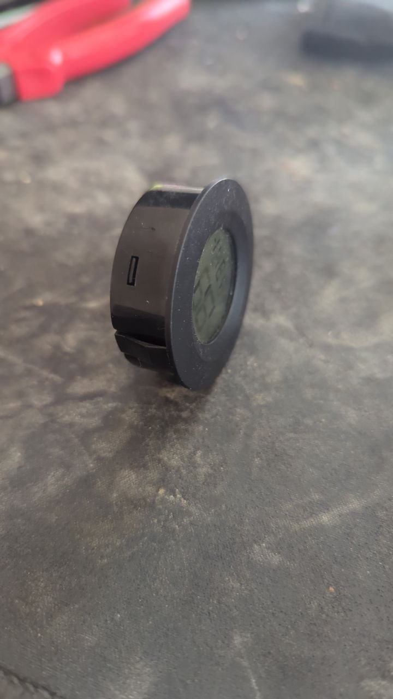
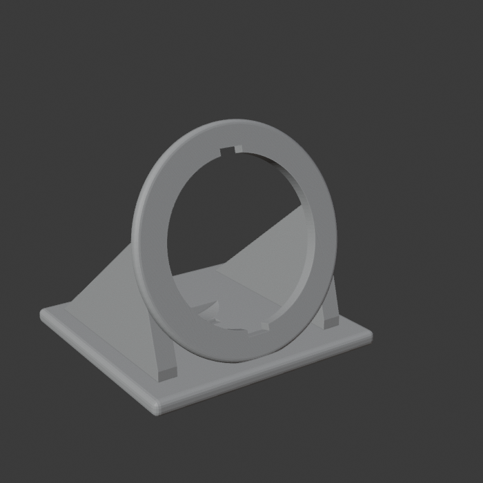
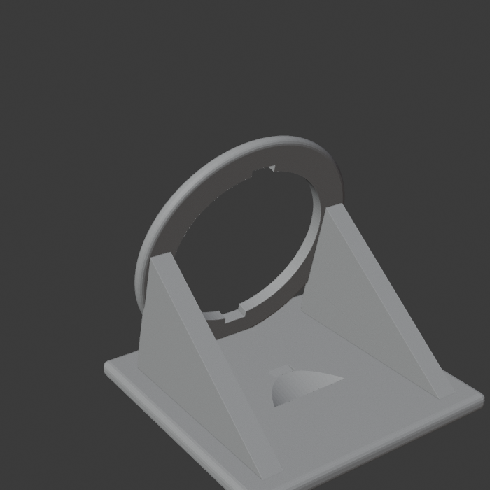

# Sensorholder — desk stand for a round thermo-hygrometer

A 3D-printed desk stand for a small round panel-mount temperature/humidity sensor.
The sensor snaps into a ring tilted back 15° (like a phone stand), so the display is easy to read on a desk.

| Sensor | Stand (front) | Stand (back) |
|---|---|---|
|  |  |  |

## Sensor

Round thermo-hygrometer: [Amazon B07JDSHD4Z](https://www.amazon.com/dp/B07JDSHD4Z)

## Sensor dimensions

- Body Ø41 mm, front flange Ø45 mm
- Two spring clips on the body, strictly top and bottom, 5 mm wide, stick out ~2 mm and don't press fully flush

## How it works

- Face ring is a 3 mm "panel" with a Ø41.4 hole; the flange rests on the front.
- Two 6 mm notches (top and bottom) take the spring clips: they squeeze ~0.5 mm, holding the sensor and keeping it from rotating. The notches are hidden behind the flange.
- Two side struts and a rounded base keep it from tipping; the space behind the ring is clear for the body.

Insert the sensor with the clips pointing straight up and down.

## Files

| File | Description |
|---|---|
| `holder.stl` | Print this. 64 × 61 × 60 mm |
| `holder.blend` | Blender scene |
| `build_holder.py` | Generator; all dimensions are constants at the top |
| `sensor.jpg` | Photo of the sensor |

## Printing

Print standing on the base, no supports needed. PLA is fine.

## Tuning

Edit constants in `build_holder.py`, then rebuild:

```sh
blender -b -P build_holder.py   # writes holder.stl and holder.blend
```

- `HOLE_D` (41.4): sensor wobbles → 41.2; too tight → 41.6
- `CLIP_H` (1.5): notch depth for the clips. Loose → 1.2; too tight → 1.8
- `BODY_LEN` (20): body depth behind the flange (guessed — measure it); sets the ring height
- `TILT` (15°): lean angle

## License

[CC BY 4.0](https://creativecommons.org/licenses/by/4.0/) — print, remix, share; credit appreciated.
